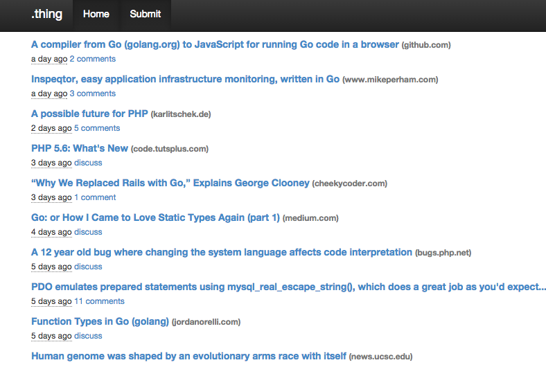

Thing
=====

Introduction
------------
This [thing](https://github.com/sdgoij/thing) is a [Hacker News](https://news.ycombinator.com/)-like
application, written in [PHP5](http://php.net/). Using [Zend Framework 2](http://framework.zend.com/)
and [Doctrine2](http://doctrine-project.org/).



Installation
------------

**Requirements:**

- PHP >= 5.5.0 + SQLite extension
- Git >= 1.8.0

```
git clone https://github.com/sdgoij/thing.git && cd thing
php -r "readfile('https://getcomposer.org/installer');"|php
php composer.phar self-update && php composer.phar install
cp config/autoload/default.local.php.dist config/autoload/default.local.php
mkdir data && ./vendor/bin/doctrine-module orm:schema-tool:create
```

Web Server Setup
----------------

### PHP CLI Server

The simplest way to get started if you are using PHP 5.4 or above is to start the internal PHP cli-server in the root directory:

    php -S 0.0.0.0:8080 -t public/ public/index.php

This will start the cli-server on port 8080, and bind it to all network
interfaces.

**Note:** The built-in CLI server is *for development only*.

### Apache Setup

To setup apache, setup a virtual host to point to the public/ directory of the
project and you should be ready to go! It should look something like below:

    <VirtualHost *:80>
        ServerName thing.local
        DocumentRoot /path/to/this/thing/public
        SetEnv APPLICATION_ENV "development"
        <Directory /path/to/this/thing/public>
            DirectoryIndex index.php
            AllowOverride All
            Order allow,deny
            Allow from all
        </Directory>
    </VirtualHost>

### NGINX Setup

First make sure you have nginx and php-fpm setup correctly. Ubuntu (14.04) users
can simply `apt-get install nginx php5-fpm php-cli php5-sqlite` others please
consult your platform specific documentation concerning the subject.

    server {
        listen 80;
        server_name thing.local;
        root /path/to/this/thing/public;
        index index.html index.htm index.php;

        location / {
            try_files $uri $uri/ /index.php;
        }

        location ~ \.php$ {
            fastcgi_split_path_info ^(.+\.php)(/.+)$;
            fastcgi_pass  unix:/var/run/php5-fpm.sock;
            fastcgi_index index.php;
            fastcgi_param SCRIPT_FILENAME $document_root$fastcgi_script_name;
            include       fastcgi_params;
        }

        location ~ \.htaccess {
            deny all;
        }
    }
